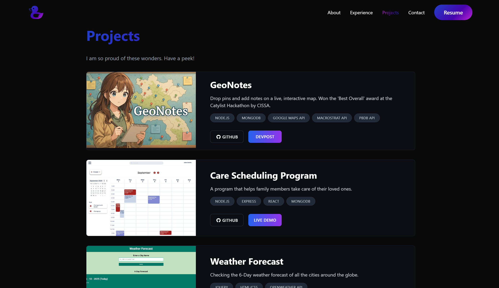
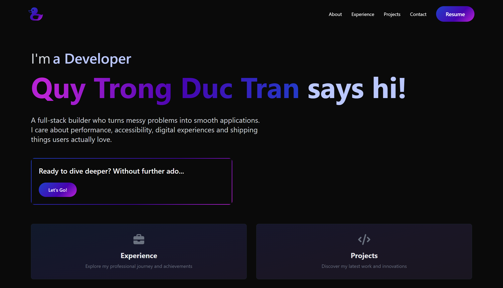

Duccu's Portfolio

A clean, fancy web app for showing who I am - Node.js + Express on the backend, React on the frontend, styled with Tailwind CSS.

🚀 Live Demo

Heroku:

🧰 Tech Stack

Backend: Node.js, Express

Frontend: React

Styling: Tailwind CSS

▶️ Run Locally

From the project root:

npm run dev

That’s it - the backend and frontend dev servers will spin up together.

📁 Project Highlights

Modern, responsive UI with Tailwind

Lightweight Express API

Easy local dev with a single command

🖼️ Snapshots

